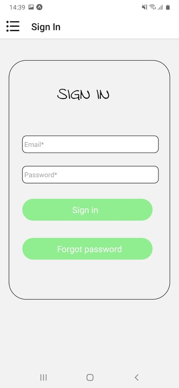
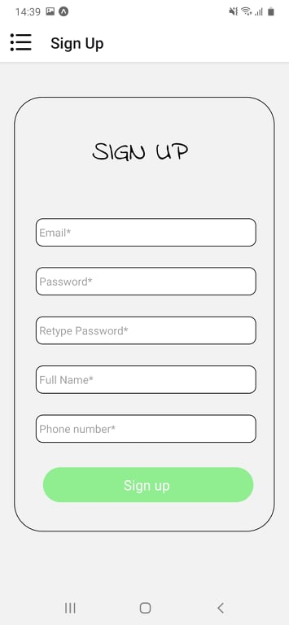
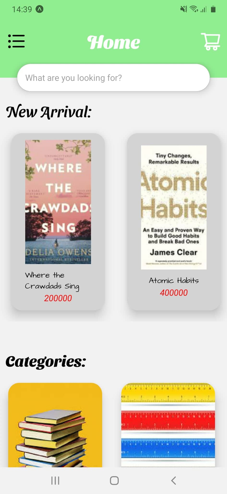
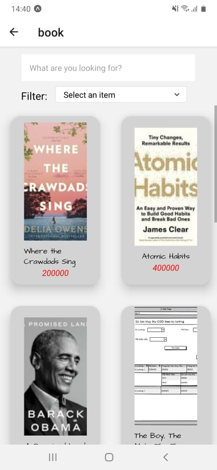
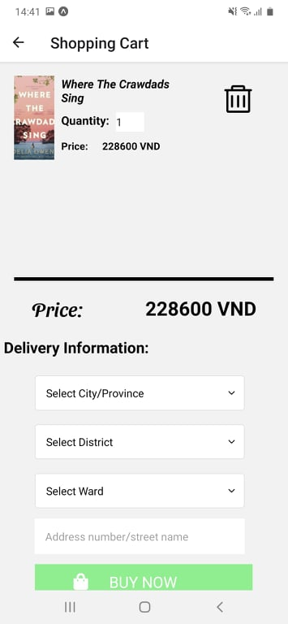
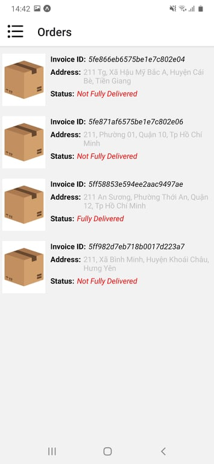
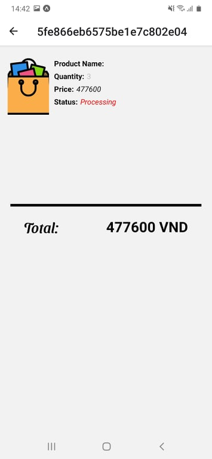

# Ứng dụng kinh doanh sách và văn phòng phẩm

Ứng dụng giúp cho các nhà giao dịch/người mua trao đổi mua bán sản phẩm

## Nội dung
1. [Chức năng](#chức-năng)

   1. [Đăng nhập / Đăng kí](#đăng-nhập-/-đăng-kí)

   1. [Xem sản phẩm](#xem-sản-phẩm)
   
   1. [Bookmark sản phẩm](#bookmark-sản-phẩm)

   1. [Xem/thêm sản phẩm vào/chỉnh sửa giỏ hàng](#xem/thêm-sản-phẩm-vào/chỉnh-sửa-giỏ-hàng)

   1. [Xem order](#xem-order)

   1. [Xem thông tin tài khoản](#xem-thông-tin-tài-khoản)
   
1. [Yêu cầu thiết bị](#yêu-cầu-thiết-bị)

1. [Thư viện và công nghệ](#thư-viện-và-công-nghệ)

1. [Tác giả](#tác-giả)

1. [Giấy phép](#giấy-phép)

## Chức năng
### Đăng nhập / Đăng kí
   * Đăng nhập
  
   * Đăng kí
   
   

    
   

    
### Xem sản phẩm
   * Xem từ trang Home
  
   * Xem theo category
  
   * Xem chi tiết sản phẩm
   
   

     
   

    
### Bookmark sản phẩm
     
   

    
   

### Xem/thêm sản phẩm vào/chỉnh sửa giỏ hàng
   * Thêm sản phẩm vào giỏ hàng
  
   * Xem giỏ hàng

   * Chỉnh sửa giỏ hàng 
   
   

    
   
   

### Xem order
   * Xem các đơn hàng
  
   * Xem chi tiết đơn hàng 
   
   

    
   

### Quản lí tài khoản
   * Xem thông tin tài khoản
  
   * Đổi mật khẩu

   * Quên mật khẩu

   

     
   

   
## Yêu cầu thiết bị
-Android:

   +Android studio : 3.0.2

   +Gradle : 4.1

   +Min sdk : 19

   +Target sdk : 26

-iOS:

   +iOS: 8.0

## Thư viện và công nghệ

- Language : Javascript

- FrameWork : React Native 0.55.4

- Database: phpMyAdmin

* react-native - https://github.com/facebook/react-native

* react-navigation - https://github.com/react-navigation/react-navigation

* react-native-maps - https://github.com/react-native-community/react-native-maps

* react-native-swiper - https://github.com/leecade/react-native-swiper

* react-native-linear-gradient - https://github.com/react-native-community/react-native-linear-gradient

* react-native-view-more-text - https://github.com/nlt2390/react-native-view-more-text

## Tác giả
Ngô Tấn Phát - 17520877@gm.uit.edu.vn

Phan Thanh Hoàng - 17520519@gm.uit.edu.vn

Nguyễn Trọng Tài - 17521002@gm.uit.edu.vn

## Giấy phép

    Copyright 2014

    Licensed under the Apache License, Version 2.0 (the "License");
    you may not use this file except in compliance with the License.
    You may obtain a copy of the License at

       http://www.apache.org/licenses/LICENSE-2.0

    Unless required by applicable law or agreed to in writing, software
    distributed under the License is distributed on an "AS IS" BASIS,
    WITHOUT WARRANTIES OR CONDITIONS OF ANY KIND, either express or implied.
    See the License for the specific language governing permissions and
    limitations under the License.
