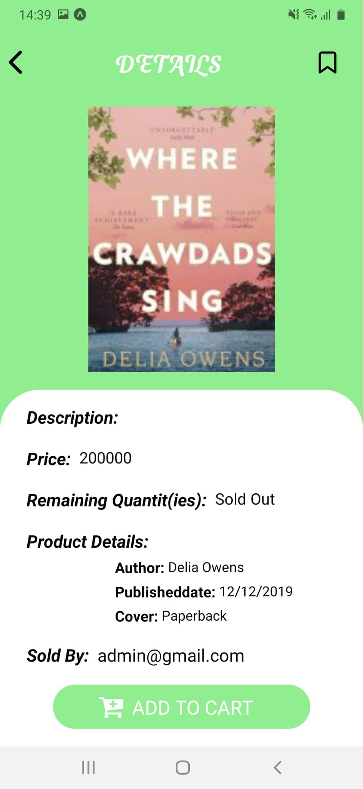
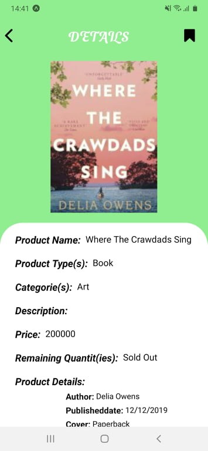
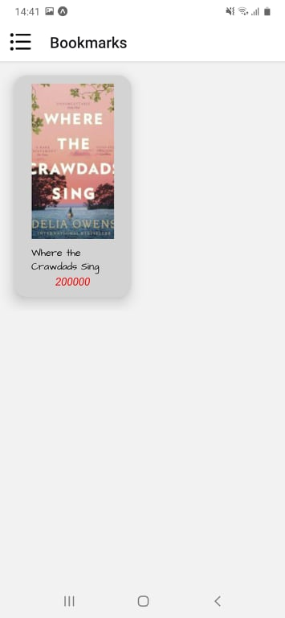

# office supplies and bookstore app

Office supplies by react native
## Main
1. [Feature](#Feature)

   1. [Login/Register](#Login)

   1. [Watching list product](#Product)
   
   1. [Bookmark product](#Bookmark-product)

   1. [Cart](#Cart)

   1. [Order](#Order)

   1. [Infomation Account](#Infomartion-account)

1. [Install](#Install)

1. [Require](#Require)

1. [Lib and framework](#Lib-framework)

1. [Author](#Author)

1. [License](#License)

## Feature
### Login/Register
   * Login
  
   * Register
   
   

    
   

    
### Watching list product
   * Home
  
   * Sort by category
  
   * Detail product
   
   

     
   

    
### Bookmark product
     
   

    
   

### Cart
   * Add cart
  
   * Check cart

   * Alter cart
   
   

    
   
   

### Order
   * Watching order
  
   * Detail order
   
   

    
   

### Infomation Account
   * Information account
  
   * Change password

   * Forgot password

   

     
   

## Install

- `git checkout latestupdate`
- `npm i`
- `expo start`

## Require
-Android:

   +Android studio : 3.0.2

   +Gradle : 4.1

   +Min sdk : 19

   +Target sdk : 26

-iOS:

   +iOS: 8.0

## Lib and Framework

- Language : Javascript

- FrameWork : React Native 0.63.0

- Backend: NodeJs + Express

- Database: MongoDb

* react-native - https://github.com/facebook/react-native

* react-navigation - https://github.com/react-navigation/react-navigation

* react-native-paper - https://callstack.github.io/react-native-paper/

* react-redux - https://redux.js.org/

* react-native-async-storage - https://github.com/react-native-async-storage/async-storage

* react-native-dropdown-picker - https://www.npmjs.com/package/react-native-dropdown-picker

## Author
Ngô Tấn Phát - 17520877@gm.uit.edu.vn

Phan Thanh Hoàng - 17520519@gm.uit.edu.vn

Trần Đình Thiện - 17521080@gm.uit.edu.vn

## License

    Copyright 2020

    Licensed under the Apache License, Version 2.0 (the "License");
    you may not use this file except in compliance with the License.
    You may obtain a copy of the License at

       http://www.apache.org/licenses/LICENSE-2.0

    Unless required by applicable law or agreed to in writing, software
    distributed under the License is distributed on an "AS IS" BASIS,
    WITHOUT WARRANTIES OR CONDITIONS OF ANY KIND, either express or implied.
    See the License for the specific language governing permissions and
    limitations under the License.

